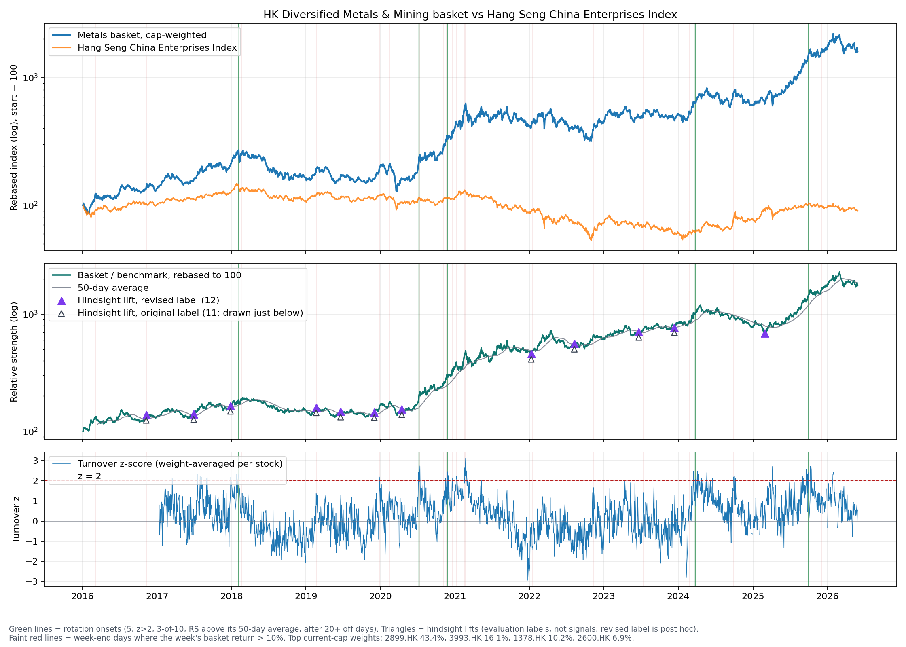

# HK Metals Sector-Rotation Detector

Can a real-time signal tell when money is rotating into Hong Kong-listed metals and mining stocks? This project builds a market-cap-weighted basket of ten HK metals names (2016–2026), flags a rotation onset when turnover surges across the basket while its relative strength against the Hang Seng China Enterprises Index (`^HSCE`) is above its 50-day average, and evaluates those onsets with an event study, a permutation test and a hindsight label of relative-strength lifts. **The signal confirms rotations rather than leading them:** all 5 onsets fired 27–152 sessions into rallies already under way (by the post-hoc revised lift label). Relative returns after onsets beat the all-days base rate (+5.7 pp over 20 sessions, p = 0.075; +7.2 pp over 60 sessions, p = 0.17), but with only 5 events that excess is not statistically significant.



*Top: basket and `^HSCE`, rebased to 100 (log scale). Middle: relative strength with its 50-day average, and hindsight lifts under the revised (filled) and original (hollow) labels. Bottom: the basket turnover z-score. Green lines are rotation onsets.*

## Quick Start

Tested with Python 3.9.6 on macOS, with the exact package versions pinned in `requirements.txt`. Python 3.9 is past end of life, so newer interpreters should work but are untested.

```bash
python3 -m venv .venv
. .venv/bin/activate
pip install -r requirements.txt
python scripts/build_metals_basket.py
python scripts/check_zijin_spin_off.py
```

`^HSI` (Hang Seng Index) is run alongside `^HSCE` as a sanity check.

The default window is pinned to `--start 2016-01-01 --end 2026-05-31` (yfinance treats `end` as exclusive) so reruns are reproducible.

Downloaded prices are cached per ticker in `data/cache/` (gitignored), keyed by ticker and date range, and the market caps used for weighting are cached in `data/cache/market_caps.json`. Reruns read from the cache; pass `--refresh-cache` to download again. Tickers that return no data are not cached, so they are retried on the next run.

The script uses a local `.matplotlib` cache directory so it does not need to write into your home folder.

## Tests

```bash
pip install -r requirements-dev.txt
python -m pytest
```

The tests run offline on small synthetic price/volume data; any call to yfinance fails the test. They cover:

- **Look-ahead (truncation) checks.** Every real-time signal (`basket_index`, `relative_strength`, `relative_strength_ma`, `turnover_z`, `hot_day_count`, `signal_ready`, `rotation_on`, `rotation_onset`, `momentum_week_above_threshold`) is recomputed on data cut off at each day `t` and must equal the full-history value on day `t`. The synthetic data includes a delisting, a suspension, a holiday Friday, a mid-week spike that reverses, and turnover surges that make the onset signal fire (with shorter windows than the config so 280 days are enough). Two deliberately look-ahead momentum flags (the original whole-week flag, and one that scores a partial week at the end of the data) are shown to fail this check.
- **Delisting.** A stock that stops trading is not forward-filled, and the index does not jump on its first missing day.
- **Benchmark failure.** A benchmark with no data is skipped, and a run whose primary benchmark fails writes no timing table or evaluation.
- **Signal rules (`test_signals.py`).** The z-score against a hand computation, zero-volume days, new listings, the weighted basket z, the count and relative-strength conditions at their edges, onset debounce, and no onsets during warm-up.
- **Evaluation (`test_evaluation.py`).** Forward-return alignment (next-session entry), base-rate eligibility, a reproducible permutation test that detects planted events, the scale-free lift label (hold and minimum gap) under both the original and the revised rule, with a brute-force check of the revision and a test pinning its known quirk, lift/onset episode classification, and the sensitivity grid.

## Outputs

- `outputs/metals_rotation_hsce.png`: stacked rotation chart vs the Hang Seng China Enterprises Index (primary).
- `outputs/metals_rotation_hsce.csv`: daily rotation data and signal flags vs the Hang Seng China Enterprises Index (primary).
- `outputs/metals_rotation_hsi.png`: stacked rotation chart vs the Hang Seng Index (sanity check).
- `outputs/metals_rotation_hsi.csv`: daily rotation data and signal flags vs the Hang Seng Index (sanity check).
- `outputs/metals_rotation_timing.csv`: first onset, momentum week and hindsight lift on or after `--analysis-start`, vs the primary benchmark.
- `outputs/rotation_onset_events.csv`: one row per onset (primary benchmark and setting) with the signal inputs, forward 20/60-session relative returns, and whether a lift followed.
- `outputs/rotation_onset_summary.csv`: onsets vs base rate per horizon, permutation p-values and episode counts, for `^HSCE` (primary) and `^HSI` (sanity), under each lift label (`lift_label` column).
- `outputs/rotation_onset_sensitivity.csv`: the same statistics over the z-threshold x count-rule grid.
- `outputs/rotation_lift_episodes.csv`: every hindsight lift under each label and whether an onset came before it, late, or not at all.
- `outputs/metals_basket_weights.csv`: the exact weights used.
- `outputs/zijin_2899_spin_off_check.png` / `.csv`: adjusted-close sanity check for Zijin Mining around the Zijin Gold listing, written by `scripts/check_zijin_spin_off.py`.

Benchmarks come from `data/metals_basket.yml`: `benchmark` (`^HSCE`) is the primary benchmark and drives the timing table; `sanity_benchmarks` (`^HSI`) are charted alongside it as a cross-check. By default the script runs both:

```bash
python scripts/build_metals_basket.py
```

If a benchmark download fails, that benchmark is skipped with a warning and the rest of the run continues; if the primary one fails, no timing table is written. Passing `--benchmarks` overrides the config, and the first ticker listed becomes primary:

```bash
python scripts/build_metals_basket.py --benchmarks ^HSCE
```

## Weighting

The basket is current market-cap weighted. The script asks Yahoo for each constituent's latest market cap (once; the result is cached, see above). If Yahoo does not return one, it falls back to the rough HKD market cap in `data/metals_basket.yml`; the source is written beside every name in `outputs/metals_basket_weights.csv`.

The price index is built as:

```text
constituent_normalized_price = adjusted_close_today / first_available_adjusted_close
basket_index = 100 * sum(constituent_weight * constituent_normalized_price)
```

The index is chained from daily returns over the names that actually traded that day, each weighted by its holding value at its last known close. A name that stops trading is never forward-filled into the index: from its first missing day its weight is re-normalized across the remaining names, without a jump in the index level. A suspended name sits out the same way and rejoins when it trades again. This uses only data available on each day, so a suspension and a delisting look the same until the name trades again. When every name trades every day this is identical to the formula above.

The basket uses current weights across the whole history. That is a known bias (see [Known Limitations](#known-limitations)), acceptable for studying rotation timing but not for an investable backtest, which would need historical weights.

Volume is shown as summed daily HKD turnover:

```text
basket_turnover = sum(adjusted_close * shares_traded)
```

I prefer turnover over raw share volume because one share of a high-priced miner and one share of a low-priced miner are not economically comparable.

## Rotation View

For each benchmark, the script inner-joins basket and benchmark dates, then rebases both to 100 at the first shared basket date. The relative-strength line is:

```text
relative_strength = 100 * ((basket_index / benchmark_index) / first_ratio)
```

A rising line means the metals basket is outperforming that market benchmark. That is the rotation definition used here.

Momentum is computed weekly (Friday-to-Friday) from the basket index. For weeks with a basket return greater than `--momentum-threshold` (default `0.10`, i.e. 10%), one day is flagged in the CSV as `momentum_week_above_threshold`: the first trading day on or after that week's Friday, which is when the weekly return is known. That is the Friday itself in a normal week. When the Friday is a holiday it is the next session, because treating Thursday as the week's close requires knowing that Friday is closed, which the price data alone cannot tell you in real time. Those days are marked as vertical lines on the charts, whose caption states the threshold used; the timing table records it in `momentum_threshold`.

`^HSCE` is the primary benchmark and `^HSI` the sanity check because the basket is mostly mainland-China companies listed in Hong Kong, so HSCE is the cleaner opportunity-cost benchmark. In the current run, both benchmarks show almost the same rotation, which strengthens the read rather than weakening it.

## Timing And Data Checks

The timing table is computed against the primary benchmark, starts at `--analysis-start` (`2025-01-01` by default), and records:

- first rotation onset;
- first week-end day where the week's basket return exceeded `--momentum-threshold`;
- first hindsight lift under the revised label (see [Evaluation](#evaluation)).

The script also checks benchmark sanity in the printed summary: the joined benchmark rows should have no missing values and no unchanged flatline run. For the current run, both `^HSI` and `^HSCE` pass that check.

Because Zijin Mining is the largest basket weight, `scripts/check_zijin_spin_off.py` plots `2899.HK` adjusted close around the September 30, 2025 Zijin Gold International listing. In the current Yahoo data, there is no one-day adjusted-price cliff on that date.

## Rotation-Onset Signal

`scripts/signals.py`, parameters under `signal:` in `data/metals_basket.yml`. Every value on day `t` uses only data up to day `t`, and the truncation tests enforce that.

1. **Turnover z-score.** For each stock, `z = (log turnover today − mean) / std`, where the mean and standard deviation come from that stock's log HKD turnover over the trailing 252 sessions, excluding today. A stock gets a z-score once it has traded for 252 sessions, and the window needs at least half its days valid. Zero-volume days (Yahoo has about a dozen per stock, mostly on the same dates) get no z-score. The basket z is the weight-averaged z over stocks that have one that day. Averaging per-stock z-scores, instead of z-scoring summed turnover, keeps a new listing (Ganfeng 2018, Tianqi 2022) from reading as a permanent turnover surge.
2. **Rotation on.** At least 3 of the last 10 sessions have basket z > 2, **and** relative strength is above its trailing 50-day average.
3. **Onset.** The first "on" day after at least 20 consecutive fully-warmed-up "off" days. No onset can fire during the warm-up.

The chart's third panel shows the basket z-score with the threshold, and onsets are green vertical lines on every panel.

## Evaluation

`scripts/evaluation.py`, parameters under `lift_label:` and `evaluation:` in the config. Everything here is allowed to look ahead, because it scores the signal after the fact.

**The parameters were fixed before any results existed.** All signal, lift-label and evaluation parameters were committed in `e973826`, before the first evaluation run on the 2016+ history. Two things happened after that commit:

- **Bug fix after the first run.** The first implementation needed all 252 days of a stock's window to be valid, so one zero-volume day switched that stock's z-score off for a year. That switched the signal off for about 60% of the history, including 2025, and it fired only twice. I saw that run's output, fixed the bug (a window needs at least half its days valid, chosen before seeing the fixed results), and reran. No parameter in the config changed.
- **Post-hoc label revision.** The pre-registered lift label missed visible major rallies, so a revised label was added after seeing the results. Both are reported (see below).

**Hindsight lift label.** The condition is "on" when the 20-day average of relative strength is at least 5% above the lowest relative strength of the prior 60 sessions. A day "holds" if the average then stays at or above that day's hurdle for 20 sessions, starting that day. A lift can't come within 60 sessions of the previous one. There are two rules for choosing the lift day:

- **Original (pre-registered, `e973826`):** the day the condition switches on, if that day holds.
- **Revised (post hoc, frozen):** in each switched-on period, the first day that holds.

The two agree whenever the switch-on day holds. The rule is scale-free: it doesn't depend on the level relative strength happens to be rebased to. It is a **hindsight label for evaluation, not a live signal**, because the hold condition looks 20 sessions ahead. It is deliberately excluded from the look-ahead tests.

**Event study.** For each onset, the forward relative return is `RS[t+1+h] / RS[t+1] − 1` for h = 20 and 60 sessions. It is measured from the close *after* the onset, since the signal is only known at the onset day's close. The base rate is the same quantity over every signal-ready day with a complete forward window. The permutation test draws the same number of random eligible dates 10,000 times (fixed seed) and reports how often they match or beat the onsets' mean and hit rate: `p = (1 + hits) / 10,001`.

**Episode check.** A lift is **early** if an onset came in the 60 sessions up to and including it, **late** if the first onset came within 20 sessions after it, and **missed** otherwise. An onset is a **false alarm** if no lift follows within 60 sessions, or **pending** if the data ends too soon to tell.

**Sensitivity.** The z threshold (1.5 / 2 / 2.5) and the count rule (3-of-10 / 5-of-20) are varied, with everything else fixed. The configured setting is marked `is_primary`.

### Post-hoc revision of the lift label

> **This revision was made after seeing the results, and both labels are now frozen.** The pre-registered label missed visible major rallies. If the condition switches on, the switch-on day fails the 20-session hold, and the condition then never switches off, no lift is ever labelled. That is what happened in 2025. The condition switched on for 2025-02-18. A drop in late February and March (relative strength fell from 735 to 685 by 2025-02-28) broke the hold. The rolling 60-session low fell with it, so the condition stayed on through the entire 2025–26 rally, with relative strength rising from about 685 to about 1,790. The revised label picks the first holding day in each switched-on period instead of requiring the switch-on day itself to hold. The thresholds, windows, hold rule and minimum gap are unchanged. Every table reports both labels (`lift_label` column), and the event study itself doesn't use the label, so its numbers are the same under both.
>
> **Known quirk of the revised rule.** A sharp drop lowers the rolling 60-session low, and so the hurdle. The revised lift can therefore land on a falling day at a local low, rather than after a 5% rise. Its one new lift, 2025-02-28, is exactly that: the lowest relative-strength reading between February and May 2025, labelled because the hurdle fell. In hindsight it marks where the 2025 rally started, but not for the reason the rule describes. The label is frozen, so this is documented rather than fixed.

### Current results (vs `^HSCE`, z > 2, 3-of-10)

There are 5 onsets: 2018-02-05, 2020-07-08, 2020-11-25, 2024-03-25 and 2025-09-30.

| Horizon | Onset mean | Onset median | Onset hit rate | Base mean | Base median | Base hit rate | Excess mean | p (mean) | p (hit rate) |
|---|---|---|---|---|---|---|---|---|---|
| 20 sessions | +8.5% | +9.8% | 5/5 | +2.8% | +1.8% | 59% | +5.7 pp | 0.075 | 0.066 |
| 60 sessions | +15.8% | +7.8% | 4/5 | +8.6% | +5.4% | 60% | +7.2 pp | 0.17 | 0.34 |

`^HSI` shows the same pattern (20-session p = 0.095, 60-session p = 0.23).

**Lifts found (2016–2026, `^HSCE`):**

- **Original label, 11 lifts:** 2016-11-09, 2017-06-29, 2017-12-27, 2019-02-20, 2019-06-20, 2019-12-02, 2020-04-15, 2022-01-10, 2022-08-09, 2023-06-21 and 2023-12-13.
- **Revised label, 12 lifts:** the same 11 plus **2025-02-28**.

`^HSI` gives 13 lifts under the original label and 15 under the revised one.

**Episode check:**

| Lift label | Lifts | Early | Late | Missed | Onsets followed by a lift | False alarms | Pending |
|---|---|---|---|---|---|---|---|
| Original | 11 | 0 | 0 | 11 | 0 | 5 | 0 |
| Revised | 12 | 0 | 0 | 12 | 0 | 5 | 0 |

**What the episode check shows (a descriptive observation, not part of the fixed evaluation):** every onset fired *inside* a switched-on period whose lift had already been labelled, well after that lift:

| Onset | Lift | Sessions after the lift |
|---|---|---|
| 2018-02-05 | 2017-12-27 | 27 |
| 2020-07-08 | 2020-04-15 | 56 |
| 2020-11-25 | 2020-04-15 | 152 |
| 2024-03-25 | 2023-12-13 | 68 |
| 2025-09-30 | 2025-02-28 (revised) | 146 |

The episode check only credits onsets up to 60 sessions before a lift or 20 after it, so all five count as misses or false alarms under both labels.

**Sensitivity.** Onset counts across the grid are 0–9. Where a setting has onsets, 9 of its 10 setting × horizon cells show a positive excess over the base rate (the exception is z > 2, 5-of-20 at 20 sessions: −4.8 pp). The smallest p-value in the grid is 0.054, and none is below 0.05 even before allowing for about 10 tests.

**How to read this:**

- **Forward returns:** the direction is encouraging, but it isn't demonstrated. Onsets were followed by better-than-usual relative returns in almost every setting, but with 1–9 events per setting nothing reaches conventional significance. More history or more baskets would be needed to tell the difference from luck.
- **Episode check:** the signal does **not** give early warning of a lift under either label. What the data suggests instead is that it's a **confirmation signal**. It fired 27–152 sessions into rallies that were already under way, and those rallies usually kept going (the forward returns above). That fits how it's built: an onset needs relative strength already above its 50-day average *and* a turnover surge, and a surge tends to come once a move is established. Whether "confirmation" holds up as a claim needs a test designed for it on data it wasn't developed on, not this post-hoc reading.

## Known Limitations

- **Current market-cap weights across the whole history.** Weights come from today's market caps (cached once) and are applied back to 2016. Historical weights would differ, especially for names that re-rated during the rally, so the early part of the index is not what a cap-weighted basket would actually have held.
- **Hindsight stock selection.** The constituents were chosen today, from names that are listed and relevant now. Stocks that fell out of the sector, were delisted, or listed later (for example 2259.HK Zijin Gold) are not in the basket, which biases the history toward survivors.
- **Delisted stocks are assumed sold at their last price.** When a name stops trading, its weight moves to the remaining names at its last close. Any final value it actually delivered to holders, such as a takeover payout or a write-down to zero, is not captured.
- **Long suspensions show up as a single-day jump when trading resumes.** A suspended name sits out of the index while halted, and the whole move from its last close to its resumption price lands on the first day it trades again.
- **Dividend-adjusted basket vs price-index benchmarks.** The basket uses dividend-adjusted closes, while `^HSCE` and `^HSI` are price indices. That pushes relative strength up by roughly the dividend yield. The comparison of onsets with the base rate cancels most of this, but a hit rate measured against zero does not.
- **Few events, overlapping windows.** Five onsets in about 9 years gives the event study little statistical power. The 60-session windows overlap, and random dates aren't clustered the way real onsets are, so the permutation p-values are somewhat optimistic.
- **The hindsight lift labels are imperfect, and the revised one is post hoc.** The pre-registered label misses sustained rallies whose switch-on day fails the hold. The post-hoc revision fixes that, but can label a lift on a falling day at a local low (see [Evaluation](#evaluation)). Both labels are frozen and reported side by side, and neither credits the signal with an early warning.

## Future Work

- **More sectors, for statistical power.** Five onsets can't separate a real effect from luck. Applying the same signal, with its parameters unchanged, to several other HK sector baskets (for example property, banks, internet and consumer) would give many more independent events and let the pooled excess return be tested properly.
- **Out-of-sample testing of any faster variant.** The finding that the signal confirms rather than leads suggests trying faster variants, such as a shorter relative-strength average or dropping the "above its average" condition. Any such variant was designed after seeing these results, so it has to be fixed in advance and tested on data it wasn't developed on (other sectors, or history after 2026-05-31), not scored on this basket's 2016–2026 history.

## License

MIT; see [LICENSE](LICENSE).
